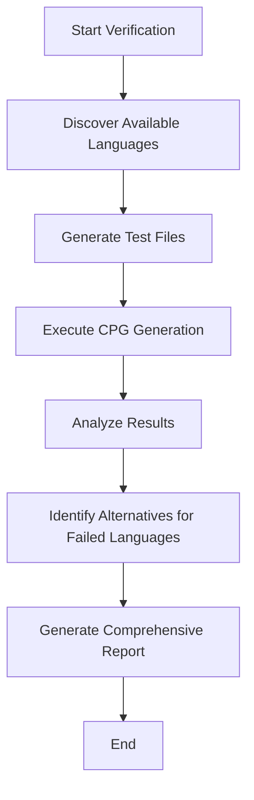

# Design Document

## Overview

The Joern Multi-Language Verification System is designed to comprehensively test and document Joern's CPG generation capabilities across multiple programming languages. Based on the analysis of the current Joern installation, the system has identified multiple language-specific tools available in the joern-cli directory.

The system will systematically test each language frontend, create standardized test files, execute CPG generation commands, and produce a comprehensive report of capabilities and limitations.

## Architecture

### Core Components

1. **Language Discovery Module**: Analyzes the Joern installation to identify available language frontends
2. **Test File Generator**: Creates representative source code files for each target language
3. **CPG Generation Engine**: Executes language-specific CPG generation commands
4. **Results Analyzer**: Processes outputs, captures errors, and categorizes results
5. **Report Generator**: Produces comprehensive documentation of findings
6. **Alternative Tool Recommender**: Suggests alternatives for unsupported languages

### System Flow



## Components and Interfaces

### Language Discovery Module

**Purpose**: Identify all available language frontends in the Joern installation

**Key Functions**:
- Scan joern-cli directory for language-specific tools
- Parse tool names to extract supported languages
- Validate tool availability and dependencies

**Discovered Language Tools** (from current installation):
- `c2cpg.bat` - C/C++ support
- `csharpsrc2cpg.bat` - C# support  
- `javasrc2cpg.bat` - Java support
- `jssrc2cpg.bat` - JavaScript support
- `kotlin2cpg.bat` - Kotlin support
- `php2cpg.bat` - PHP support
- `pysrc2cpg.bat` - Python support
- `rubysrc2cpg.bat` - Ruby support
- `swiftsrc2cpg.bat` - Swift support
- `gosrc2cpg.bat` - Go support

### Test File Generator

**Purpose**: Create representative source code samples for each language

**Test File Specifications**:
- **C (test_sample.c)**: Basic function with control flow, variables, and function calls
- **C++ (test_sample.cpp)**: Class definition with methods, inheritance, and STL usage
- **C# (test_sample.cs)**: Class with properties, methods, and exception handling
- **Python (test_sample.py)**: Function definitions, imports, and basic data structures
- **Java (test_sample.java)**: Class with methods, exception handling, and collections
- **PHP (test_sample.php)**: Function definitions, arrays, and basic web constructs
- **JavaScript (test_sample.js)**: Functions, objects, and async patterns
- **Kotlin (test_sample.kt)**: Class definitions and null safety features
- **Ruby (test_sample.rb)**: Class definitions and Ruby-specific constructs
- **Swift (test_sample.swift)**: Class definitions and Swift-specific features
- **Go (test_sample.go)**: Package definition, functions, and Go-specific constructs

**Interface**:
```python
class TestFileGenerator:
    def generate_test_file(self, language: str, output_path: str) -> bool
    def get_test_content(self, language: str) -> str
    def validate_syntax(self, language: str, content: str) -> bool
```

### CPG Generation Engine

**Purpose**: Execute CPG generation for each language using appropriate tools

**Command Templates**:
- C/C++: `c2cpg.bat -J-Xmx4g <input_file> --output <output_dir>`
- C#: `csharpsrc2cpg.bat -J-Xmx4g <input_file> --output <output_dir>`
- Java: `javasrc2cpg.bat -J-Xmx4g <input_file> --output <output_dir>`
- Python: `pysrc2cpg.bat -J-Xmx4g <input_file> --output <output_dir>`
- PHP: `php2cpg.bat -J-Xmx4g <input_file> --output <output_dir>`
- JavaScript: `jssrc2cpg.bat -J-Xmx4g <input_file> --output <output_dir>`
- Others: Similar pattern with respective tools

**Interface**:
```python
class CPGGenerationEngine:
    def generate_cpg(self, language: str, input_file: str, output_dir: str) -> GenerationResult
    def get_command_template(self, language: str) -> str
    def execute_command(self, command: str) -> ExecutionResult
```

### Results Analyzer

**Purpose**: Process CPG generation results and categorize outcomes

**Analysis Categories**:
- **Success**: CPG generated successfully with no errors
- **Success with Warnings**: CPG generated but with non-critical warnings
- **Partial Success**: Some components generated but with limitations
- **Failure**: CPG generation failed completely
- **Tool Missing**: Required frontend tool not available

**Metrics Collected**:
- Execution time
- Memory usage
- Output file sizes
- Error messages and types
- Warning counts and categories

**Interface**:
```python
class ResultsAnalyzer:
    def analyze_result(self, result: GenerationResult) -> AnalysisReport
    def categorize_outcome(self, result: GenerationResult) -> str
    def extract_metrics(self, result: GenerationResult) -> Dict[str, Any]
```

## Data Models

### GenerationResult
```python
@dataclass
class GenerationResult:
    language: str
    input_file: str
    output_dir: str
    success: bool
    execution_time: float
    memory_usage: int
    stdout: str
    stderr: str
    return_code: int
    output_files: List[str]
```

### AnalysisReport
```python
@dataclass
class AnalysisReport:
    language: str
    category: str  # success, success_with_warnings, partial_success, failure, tool_missing
    metrics: Dict[str, Any]
    errors: List[str]
    warnings: List[str]
    recommendations: List[str]
```

### LanguageSupport
```python
@dataclass
class LanguageSupport:
    language: str
    tool_available: bool
    tool_path: str
    supported: bool
    alternative_tools: List[str]
    notes: str
```

## Error Handling

### Error Categories

1. **Tool Not Found**: Language frontend not available in Joern installation
2. **Syntax Errors**: Test file contains invalid syntax for the language
3. **Memory Errors**: Insufficient memory for CPG generation
4. **Timeout Errors**: CPG generation exceeds time limits
5. **Permission Errors**: Insufficient permissions to execute tools or write outputs
6. **Dependency Errors**: Missing language-specific dependencies

### Error Recovery Strategies

- **Tool Not Found**: Document as unsupported, suggest alternatives
- **Memory Errors**: Retry with reduced memory settings, suggest system requirements
- **Timeout Errors**: Retry with simpler test files, document performance characteristics
- **Permission Errors**: Provide setup instructions for proper permissions
- **Dependency Errors**: Document required dependencies and installation steps

## Testing Strategy

### Test Execution Flow

1. **Pre-flight Checks**: Verify Joern installation and basic functionality
2. **Sequential Language Testing**: Test each language individually to avoid interference
3. **Parallel Execution**: Where safe, run multiple tests concurrently for efficiency
4. **Cleanup**: Remove temporary files and reset environment between tests

### Test Validation

- **Output Verification**: Confirm CPG files are generated and contain expected structures
- **Content Analysis**: Verify CPG contains nodes and edges representing the test code
- **Performance Benchmarking**: Measure and compare performance across languages
- **Regression Testing**: Ensure consistent results across multiple runs

### Alternative Tool Integration

For languages not supported by Joern or with limited support:

**Tree-sitter Integration** (Primary alternative for Python and other languages):
- Installation and setup instructions
- Command-line usage examples
- Comparison with Joern output format
- Conversion utilities for compatibility

**Language-Specific Parsers**:
- AST generators for each language
- Static analysis tools
- Integration approaches with existing workflow

## Performance Considerations

### Resource Management
- Memory allocation strategies for large codebases
- Timeout configurations for different languages
- Concurrent execution limits
- Temporary file cleanup

### Scalability
- Batch processing capabilities for multiple files
- Progress tracking and resumption
- Incremental testing for large language sets
- Resource usage monitoring and optimization

## Security Considerations

### Input Validation
- Sanitize test file content to prevent code injection
- Validate file paths to prevent directory traversal
- Limit resource consumption to prevent DoS

### Output Security
- Secure temporary file handling
- Proper cleanup of sensitive intermediate files
- Access control for generated reports and logs